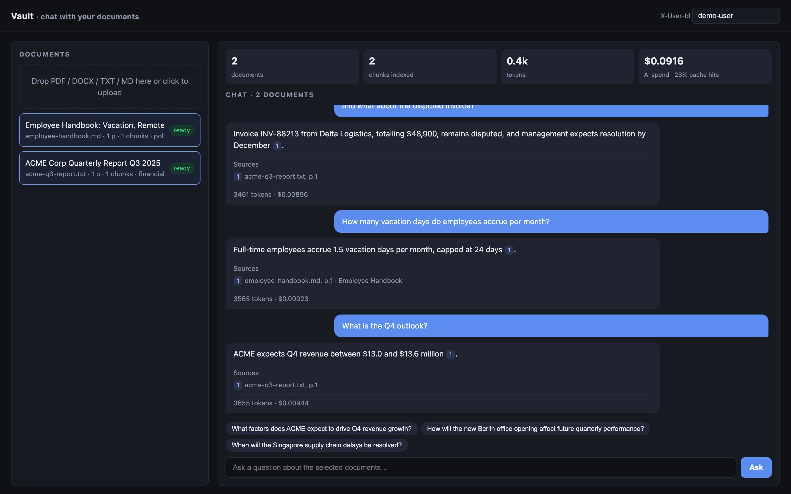
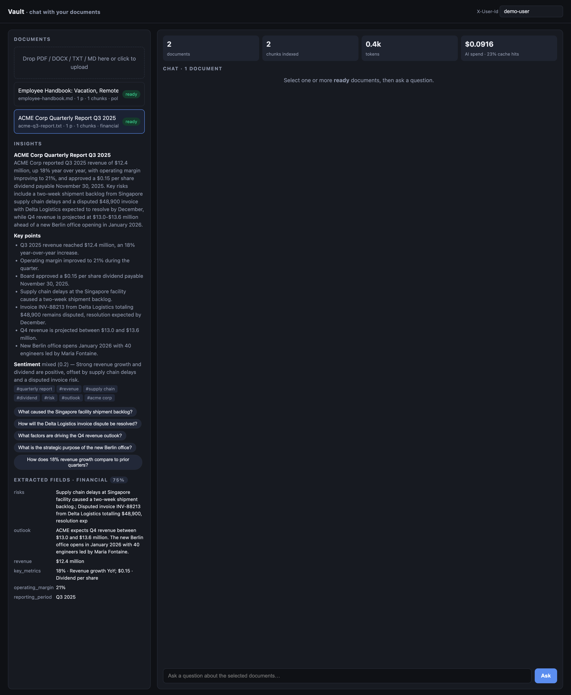
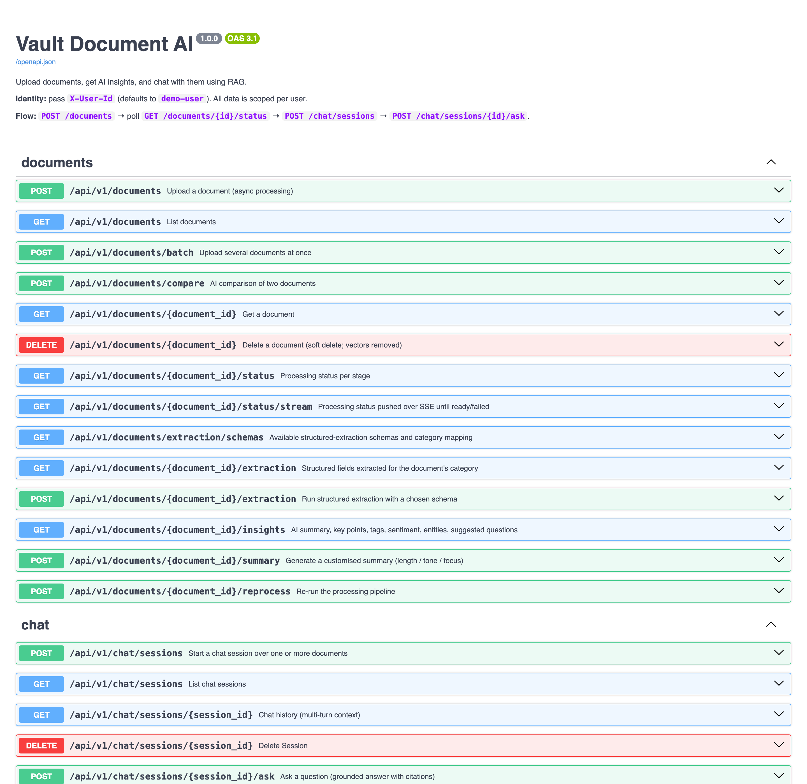
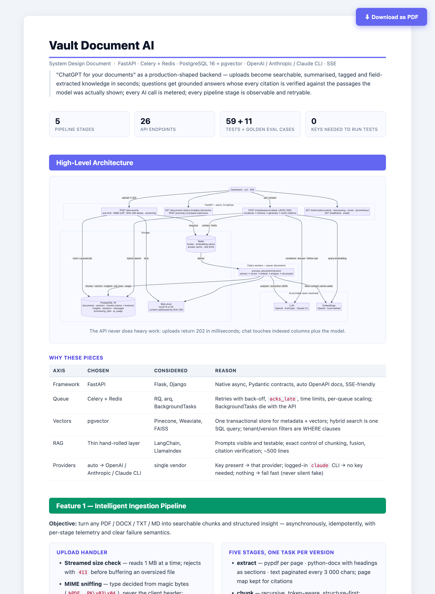

# Vault Document AI

**"ChatGPT for your documents" — as a production-shaped backend.**
Upload PDF / DOCX / TXT / MD, get AI insights (summary, key points, tags, sentiment,
entities, suggested questions), and chat with one or many documents through a RAG
pipeline that returns grounded answers with verified citations. Every stage is
asynchronous, observable and cost-tracked.

Design Doc https://drive.google.com/file/d/14p5wY9PJBfBZ7jVlskz9mhw680-Geoqn/view?usp=sharing

| | |
|---|---|
| Run it | [§1](#1-run-it--complete-steps) — Docker Compose, one API key **or** a logged-in Claude CLI |
| API docs | `http://localhost:8000/docs` (OpenAPI) |
| Dashboard | `http://localhost:8000/` (upload · status · streaming chat with citations) |
| Design doc | [`DESIGN.html`](DESIGN.html) — architecture & flows with Mermaid diagrams, printable to PDF |
| Decisions | [`APPROACH.md`](APPROACH.md) — options considered, why each was chosen, task breakdown |
| Evaluation | `python scripts/eval.py` — golden Q&A suites, answer accuracy, citation precision/recall, abstention; CI thresholds in [`evals/thresholds.yaml`](evals/thresholds.yaml) |
| AI usage | [`AI_USAGE.md`](AI_USAGE.md) — how AI tools were used to build this, prompt engineering notes |

---

## 0. Demo — real run with Claude (screenshots)

Everything below was produced by `python scripts/demo.py` against a live stack using
Claude (Sonnet for answers/analysis, Haiku for the cheap steps, via the `claude-cli`
provider) and captured from the built-in dashboard.

**Multi-document chat with verified citations, follow-ups and per-answer cost**



**AI insights + structured extraction (schema picked from the detected category)**



**Swagger (`/docs`)** · **Design document (`DESIGN.html`)**

<p>
  
  
</p>

<details>
<summary><b>Demo transcript (real model output)</b></summary>

```text
── insights ──────────────────────────────────────────────────────────────
  [financial] ACME Corp Quarterly Report Q3 2025
    ACME Corp's Q3 2025 quarterly report shows revenue of $12.4 million, an 18% year-over-year increase, along with improved operating margin of 21%. The board approved a dividend of $0.15 per share payab
    tags=['quarterly report', 'revenue', 'dividend', 'supply chain', 'outlook', 'expansion'] sentiment=positive
    suggested: ['What caused the supply chain delays at the Singapore facility?', 'How will the Delta Logistics invoice dispute be resolved?']
  [policy] Employee Handbook: Vacation, Remote Work, and Expenses Policy
    This excerpt from an employee handbook outlines three core workplace policies. It details vacation accrual rates and request procedures, remote work eligibility and required core hours, and expense re
    tags=['hr policy', 'vacation', 'remote work', 'expenses', 'employee handbook', 'workplace rules'] sentiment=neutral
    suggested: ['How many vacation days can an employee accrue in total per year?', 'What is the process for requesting vacation time?']

── structured extraction (schema chosen from AI category) ────────────────
  a701bd89 schema=financial confidence=0.75 filled=6/7
     risks: [{'risk': 'Supply chain delays at Singapore facility caused a two-week shipment backlog.'}
     outlook: ACME expects Q4 revenue between $13.0 and $13.6 million. The new Berlin office opens in Ja
     revenue: $12.4 million
     key_metrics: [{'value': '18%', 'metric': 'Revenue growth YoY'}, {'value': '$0.15', 'metric': 'Dividend 
     operating_margin: 21%
  2b0c82ad schema=policy confidence=0.6 filled=3/6
     rules: [{'rule': 'Accrue 1.5 vacation days per month, capped at 24 days; requests submitted two w
     applies_to: Full-time employees
     policy_name: Employee Handbook

── structured extraction (schema chosen from AI category) ────────────────
  a701bd89 schema=financial confidence=0.75 filled=6/7
     risks: [{'risk': 'Supply chain delays at Singapore facility caused a two-week shipment backlog.'}
     outlook: ACME expects Q4 revenue between $13.0 and $13.6 million. The new Berlin office opens in Ja
     revenue: $12.4 million
     key_metrics: [{'value': '18%', 'metric': 'Revenue growth YoY'}, {'value': '$0.15', 'metric': 'Dividend 
     operating_margin: 21%
  2b0c82ad schema=policy confidence=0.6 filled=3/6
     rules: [{'rule': 'Accrue 1.5 vacation days per month, capped at 24 days; requests submitted two w
     applies_to: Full-time employees
     policy_name: Employee Handbook

── multi-document chat ───────────────────────────────────────────────────
  session 4fe27356-340f-484b-ba64-e1bfd2f950aa
  Q: What was the Q3 revenue and who leads the Berlin office?
  A: Revenue for the third quarter reached $12.4 million, an increase of 18% year over year [1]. The new Berlin office, opening in January 2026 with 40 engineers, will be led by Maria Fontaine [1].
     [1] acme-q3-report.txt p.1  “ACME Corp Quarterly Report Q3 2025
     follow-ups: ['What is the expected revenue range for Q4 2025?', 'How many engineers will work at the Berlin office?', 'What supply chain issues affected the Singapore facility?']   cost=$0.00796 cached=False
  Q: and what about the disputed invoice?
     (condensed → What is the status of the disputed invoice?)
  A: Invoice INV-88213 from Delta Logistics, totalling $48,900, remains disputed, and management expects resolution by December [1].
     [1] acme-q3-report.txt p.1  “ACME Corp Quarterly Report Q3 2025
     follow-ups: ['What is the amount in dispute for invoice INV-88213?', 'Why is the Delta Logistics invoice disputed?', 'What actions has management taken to resolve the invoice dispute?']   cost=$0.00896 cached=False
  Q: How many vacation days do employees accrue per month?
  A: Full-time employees accrue 1.5 vacation days per month, capped at 24 days [1].
     [1] employee-handbook.md p.1  “# Employee Handbook
     follow-ups: ['What is the maximum number of vacation days employees can accumulate?', 'How far in advance must vacation requests be submitted?', 'Do part-time employees accrue vacation days at a different rate?']   cost=$0.00923 cached=False

── streaming (SSE) ───────────────────────────────────────────────────────
  ⟳ understanding
  ⟳ retrieving
  sources: ['acme-q3-report.txt', 'employee-handbook.md']
    ⟳ answering
ACME expects Q4 revenue between $13.0 and $13.6 million [1].
  ✓ persisted message 1efac392-d1a8-4b75-ad06-3be198dcfecf
```

</details>

Processing time with a real model: ~20 s per document (analysis ≈ 12 s, extraction ≈ 7 s), chat ≈ 3–5 s per answer, ≈ $0.01 per answer, ≈ $0.09 for the whole demo.

---

## 1. Run it — complete steps

### Prerequisites
* Docker Desktop (or any Docker engine with Compose v2)
* **One** of the following for AI:
  * an OpenAI API key, **or**
  * an Anthropic API key, **or**
  * the Claude Code CLI installed and logged in (`npm i -g @anthropic-ai/claude-code && claude` → `/login`) — no API key needed
* Python 3.12+ only if you want to run the demo / tests from the host

### 1. Clone and configure
```bash
git clone <this repo> && cd coding-challenges/vault-document-ai
cp .env.example .env
```
Open `.env` and set your key (leave `LLM_PROVIDER=auto`):
```bash
OPENAI_API_KEY=sk-...          # → GPT-4o-mini + text-embedding-3-small
# or
ANTHROPIC_API_KEY=sk-ant-...   # → Claude Sonnet 4 (embeddings: OpenAI if key present, else local hashed)
# or nothing: a logged-in `claude` CLI on this machine is used automatically
```
Provider resolution order is `OPENAI_API_KEY` → `ANTHROPIC_API_KEY` → `claude` CLI. If none is
available the API **refuses to start** with a message saying what to set — it never
silently falls back to fake data. (`LLM_PROVIDER=fake` can be set explicitly for offline
tests; that is what CI uses.)

### 2. Start everything
```bash
docker compose up -d --build
```
This starts PostgreSQL 16 + pgvector, Redis, runs the Alembic migrations, then the API
(2 uvicorn workers on `:8000`) and one Celery worker (4 concurrent documents).

> Using the `claude-cli` option? The CLI login lives on your host, so run the API and
> worker on the host instead of in Docker (see *Local development* below) and keep only
> `db` and `redis` in Docker.

### 3. Verify
```bash
curl -s localhost:8000/api/v1/health/ready      # {"status":"ok","checks":{"database":true,"pgvector":true,"redis":true},...}
curl -s localhost:8000/api/v1/chat/providers    # shows which LLM / embedding provider was resolved
```
Open **http://localhost:8000/** (dashboard) and **http://localhost:8000/docs** (Swagger).

### 4. Try it
```bash
pip install httpx                # only dependency of the demo script
python scripts/demo.py           # upload 2 sample docs → status stream → insights → extraction → multi-doc chat → SSE → metrics
python scripts/demo.py --file path/to/your.pdf --file another.docx   # your own documents
```
Or with curl:
```bash
API=localhost:8000/api/v1
ID=$(curl -s -F "file=@report.pdf" $API/documents | python3 -c "import sys,json;print(json.load(sys.stdin)['document']['id'])")
curl -N $API/documents/$ID/status/stream                       # watch the pipeline
curl -s $API/documents/$ID/insights | python3 -m json.tool
SID=$(curl -s -X POST $API/chat/sessions -H 'content-type: application/json' -d "{\"document_ids\":[\"$ID\"]}" | python3 -c "import sys,json;print(json.load(sys.stdin)['id'])")
curl -s -X POST $API/chat/sessions/$SID/ask -H 'content-type: application/json' -d '{"question":"What is this document about?"}' | python3 -m json.tool
```
All requests are scoped by the `X-User-Id` header (default `demo-user`).

### 5. Stop
```bash
docker compose down        # keep data volumes
docker compose down -v     # wipe database + blobs
```

### Local development (infra in Docker, app on the host)
```bash
python3 -m venv .venv && source .venv/bin/activate     # Python 3.12 or 3.13
pip install -r requirements-dev.txt
make infra      # docker compose up -d db redis   (host ports 5433 / 6380 so a local Postgres/Redis don't clash)
make migrate    # alembic upgrade head
make api        # uvicorn --reload on :8000            (terminal 1)
make worker     # celery worker, threads pool           (terminal 2)
make test       # 59 tests: unit + API integration (integration skips if DB is down)
make eval       # golden-set evaluation report (answer accuracy, citation P/R, abstention, latency, cost)
```
The default `.env` points at `localhost:5433` / `localhost:6380`, matching `make infra`.
`make worker` uses Celery's threads pool because the prefork pool crashes on macOS with
Python 3.13; Docker (Linux) uses prefork.

> Embedding dimension is fixed in the schema (`EMBEDDING_DIMENSIONS=1536`, matching
> `text-embedding-3-small`). The local hashed embedder emits the same size, so you can switch
> providers without a migration — but existing vectors must be re-embedded
> (`POST /documents/{id}/reprocess`) because the spaces differ.

---

## 2. What it does — the 60-second tour

```
POST /api/v1/documents            ──► 202 {document, task_id}      (dedup by SHA-256, versioning)
GET  /api/v1/documents/{id}/status ──► per-stage progress: extract → chunk → embed → analyse
GET  /api/v1/documents/{id}/insights ► summary, key points, category, tags, sentiment, entities, suggested questions
POST /api/v1/documents/{id}/summary ► customised summary (length / tone / focus), cached by options
POST /api/v1/documents/compare     ──► AI comparison of two documents
GET  /api/v1/documents/{id}/extraction ► structured fields for the doc's category (invoice, contract, report…)
POST /api/v1/documents/{id}/extraction ► run extraction with a chosen schema; GET /documents/extraction/schemas lists them
GET  /api/v1/documents/{id}/status/stream ► SSE push of stage progress until ready/failed (real-time alternative to polling)
POST /api/v1/chat/sessions         ──► session over 1..20 documents (multi-document chat)
POST /api/v1/chat/sessions/{id}/ask ► grounded answer + verified citations + follow-up questions
POST /api/v1/chat/sessions/{id}/ask/stream ► same over SSE: status → citations → tokens → follow_ups → done
GET  /api/v1/chat/sessions/{id}    ──► full history (multi-turn context is server-side)
GET  /api/v1/metrics/documents | /processing | /costs | /prometheus
GET  /api/v1/health/live | /ready
```

Identity is the `X-User-Id` header (default `demo-user`); every row is tenant-scoped.

---

## 3. Architecture

```
                 ┌────────────┐   upload (202)   ┌──────────────┐  enqueue  ┌───────────┐
  client ──────► │  FastAPI   │ ───────────────► │  PostgreSQL  │ ◄──────── │  Celery   │
  (dashboard,    │  (async)   │                  │  + pgvector  │  stages   │  workers  │
   curl, SDK)    └─────┬──────┘                  └──────▲───────┘           └─────┬─────┘
        ▲              │ chat: embed → hybrid search ───┘                         │
        │ SSE          │ (vector ∪ FTS, RRF) → LLM → verify citations             │ extract → chunk →
        └──────────────┤                                                          │ embed → analyse
                       ▼                                                          ▼
                 ┌────────────┐  embeddings · answers · rate limits · broker  ┌──────────┐
                 │   Redis    │ ◄────────────────────────────────────────────│ LLM APIs │
                 └────────────┘                                              └──────────┘
```

**Ingestion pipeline (Celery, one task per document version)**

1. `extract` – pypdf / python-docx / text; page map preserved; MIME sniffed from magic bytes.
2. `chunk` – recursive token-aware splitter (headings → paragraphs → sentences → tokens),
   400 tokens with 60-token overlap, page range + section per chunk.
3. `embed` – batched (100/request) through a Redis cache keyed by `sha256(model+text)`;
   vectors stored in pgvector with an HNSW index; a generated `tsvector` column is
   indexed with GIN for keyword search.
4. `analyse` – one schema-constrained LLM call on a representative excerpt → summary,
   key points, category, tags, sentiment, entities, language, suggested questions.
5. `structured` (optional, non-fatal) – the category picks an extraction schema
   (invoice → vendor/total/line items; contract → parties/term/governing law;
   report → period/revenue/risks/outlook; …) and a second JSON call fills it with
   verbatim values + a confidence score → `document_insights.kind = "extraction"`.

Each stage writes a `processing_jobs` row (status, attempt, duration, meta, error).
Permanent failures (unreadable PDF) mark the document `failed` immediately; transient
ones (provider 5xx / timeouts) retry with exponential back-off, max 3 attempts.

**Chat (RAG)**

1. **Condense** the follow-up into a standalone question using the last turns (fast model).
2. **Cache** check: same documents + same standalone question within the TTL → cached answer.
3. **Retrieve**: query embedding → pgvector cosine top-20 ∪ full-text top-20 →
   Reciprocal Rank Fusion → top-8 → trimmed to a 3 000-token context budget.
   With `RERANK_ENABLED=true` the 20 fused candidates are re-scored by a
   cross-encoder (`sentence-transformers`, local), the fast LLM, or a lexical
   scorer, blended with the RRF score (`RERANK_WEIGHT`), then cut to top-8.
4. **Generate** with a grounding prompt that requires `[n]` citations per factual sentence.
5. **Verify** citations programmatically: markers pointing to passages that were not
   provided are removed; the rest are renumbered densely and returned with
   file / page / section / snippet.
6. **Follow-ups**: 3 suggested next questions (fast model, best-effort).

Prompts live in [`app/ai/prompts.py`](app/ai/prompts.py); reasoning in [`AI_USAGE.md`](AI_USAGE.md).

---

## 4. Data model

| table | purpose |
|---|---|
| `documents` | logical document; owner, status, AI-derived title/category/tags, denormalised counts |
| `document_versions` | each uploaded revision; SHA-256, storage key, size (content-addressed blobs) |
| `chunks` | text + `embedding vector(1536)` (HNSW) + generated `content_tsv` (GIN); page range, section |
| `document_insights` | JSONB analysis per (version, options-hash) — several summaries can coexist |
| `chat_sessions` | owner, document ids (multi-doc), counts |
| `chat_messages` | role, content, standalone question, citations JSONB, follow-ups, usage/cost |
| `processing_jobs` | one row per stage attempt: status, duration, meta, error → processing metrics |
| `ai_usage` | one row per AI call: purpose, provider, model, tokens, USD, latency, cached → cost metrics |

Schema managed by Alembic (`alembic/versions`).

---

## 5. Production concerns

| concern | implementation |
|---|---|
| **Concurrency** | async API on asyncpg pool; N Celery workers, `acks_late`, `prefetch_multiplier=1`, soft/hard time limits; dedicated `documents` queue |
| **Idempotency** | SHA-256 dedup (same bytes → same document, 200 not reprocessed); pipeline wipes a version's chunks before re-running so retries never duplicate |
| **Versioning** | `replace_document_id` creates version N+1; chunks/insights are per version; chat always uses the current version |
| **Latency** | SSE streaming; embedding batching + Redis cache; answer cache; hybrid search on indexed columns; token-budgeted context |
| **Cost** | every call priced from a model table into `ai_usage`; `/metrics/costs` by purpose & model; cache hit rate; cheap model for condense/follow-ups |
| **Rate limiting** | Redis sliding window per user for chat (30/min) and upload (20/min), `429` + `Retry-After`; fails open if Redis is down |
| **Input hardening** | size limit streamed (413 before buffering), MIME sniffing (415), page & chunk caps, empty-file 400 |
| **Failure isolation** | per-stage status/error; `POST /reprocess` (`?force=true` for orphaned runs); a broker outage marks the doc `failed` with a clear message instead of a 500 |
| **Observability** | structlog JSON with request ids, Prometheus histograms/counters, `/health/ready` checks DB + pgvector + Redis |
| **Multi-tenancy** | `owner_id` on every table, enforced in every query; identity dependency is the single swap point for JWT |
| **Offline / CI** | Explicit `LLM_PROVIDER=fake` runs the whole system with zero keys for tests/CI (~3 s); `auto` never falls back to it |
| **Quality gates** | Golden-set eval (`evals/`) scores answer accuracy, citation precision/recall and abstention; GitHub Actions runs it with strict thresholds on every push (Fake) and nightly against a real provider (`.github/workflows/ci.yml`) |
| **Retrieval quality** | Optional reranker behind a flag: cross-encoder / LLM / lexical; falls back safely if the model can't load |
| **Typed outputs** | Structured extraction per category with per-schema caching and `POST /extraction` to re-run with another schema |

### Scaling to thousands of documents

* API and workers are stateless → scale horizontally; Postgres is the only stateful piece besides blob storage (swap `LocalStorage` for `S3Storage` via env).
* HNSW keeps vector search sub-10 ms at millions of chunks; the tenant filter uses a btree index so per-user search does not scan the whole table.
* Embedding cache makes re-uploads and near-duplicate corpora cheap; `worker --concurrency` and Celery autoscale handle burst ingestion.
* Beyond ~50 M chunks: partition `chunks` by tenant hash or move vectors to a dedicated store — retrieval is isolated in `app/ai/retrieval.py`.

---

## 6. Assumptions & trade-offs

* **Auth is a header.** The case study is about the AI backend; real auth (JWT/OIDC) plugs into `get_current_user`.
* **Analysis uses a sampled excerpt** (head + spread) rather than map-reduce. Faster, ~10× cheaper, good enough for metadata; chat uses full retrieval anyway.
* **No OCR.** Scanned PDFs fail with a clear message; adding Tesseract/Textract is a new extractor.
* **Hand-rolled RAG** instead of LangChain — fewer moving parts and every prompt visible; see `APPROACH.md §2.4`.
* **Reranker off by default.** Lexical/LLM rerankers add latency; the cross-encoder needs `pip install sentence-transformers` (~100 MB). Flip `RERANK_ENABLED` when recall on large corpora matters — the eval harness measures the effect.
* **Structured extraction uses the same sampled excerpt** as analysis; line-item-heavy invoices longer than ~6 k tokens would need a per-page pass.
* **Local tokenizer fallback.** If the tiktoken BPE file cannot be downloaded (air-gapped / TLS-intercepted networks), a word-level tokenizer is used; budgets are conservative.
* **macOS dev note.** Celery's prefork pool crashes under Python 3.13's `spawn` start method on macOS; `make worker` uses the threads pool. Docker (Linux) uses prefork.

---

## 7. Coverage against the brief

| Brief item | Where |
|---|---|
| Intelligent upload handler · smart analysis · async pipeline | `POST /documents`, stages 1–5, `app/workers/tasks.py` |
| Upload & ingestion · retrieval · AI insights APIs | `app/api/documents.py` |
| Start session · ask · history · multi-turn | `app/api/chat.py`, condense-question in `app/ai/rag.py` |
| Document statistics · processing metrics APIs | `GET /metrics/documents`, `GET /metrics/processing` (+ `/costs`, `/prometheus`) |
| Data storage for metadata, insights, chats, citations, metrics, performance | `app/models.py` (8 tables, see §4) |
| Multi-doc chat · follow-ups · summary customisation · tagging · sentiment · comparison | bonus features, all implemented |
| Dashboard · real-time updates · caching · vector DB · streaming · tests | `static/index.html`, SSE for chat **and** status, Redis caches, pgvector, 55 tests + eval |
| Cost tracking · rate limiting · versioning · batch · logging · health | §5 |
| Not done | OCR for scanned PDFs (clear failure message instead); WebSocket transport (SSE used for both real-time channels) |

## 8. Project layout

```
app/
  main.py               FastAPI app, middleware (request id, Prometheus), routers, static dashboard
  core/                 settings, logging, async + sync engines
  models.py             SQLAlchemy models (single schema source)
  schemas.py            Pydantic API contracts
  api/                  documents.py · chat.py · metrics.py · health.py · deps.py (identity, rate limit)
  services/             storage.py · extraction.py · chunking.py · cache.py
  ai/                   providers.py (OpenAI/Anthropic/Fake) · prompts.py · embeddings.py · retrieval.py · rerank.py · rag.py · analysis.py · structured.py · usage.py
  workers/              celery_app.py · tasks.py (pipeline)
alembic/                migrations
static/index.html       dashboard
scripts/demo.py         end-to-end demo · scripts/eval.py golden-set evaluation
evals/                  runner.py · thresholds.yaml · golden/*.yaml (documents + Q&A + expected sources)
.github/workflows/ci.yml lint → migrate → tests → strict eval (Fake); nightly eval on a real provider
tests/                  test_unit.py · test_api.py · test_features.py (rerank, extraction, SSE status) · test_eval.py
```
